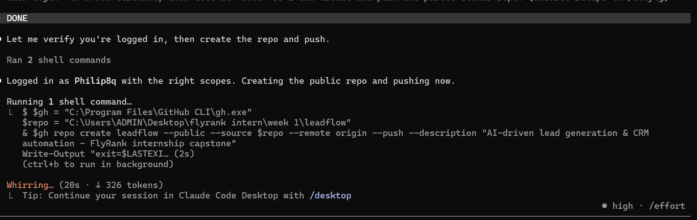
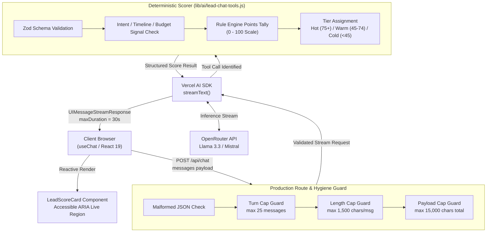

# LeadFlow: Autonomous AI Lead Qualification & CRM Engine

[](./LICENSE)
[](https://nodejs.org)
[](https://nextjs.org)
[](https://leadflow-ten-sage.vercel.app)
[](https://github.com/Philip8q/leadflow)
[](https://leadflow-ten-sage.vercel.app/demo/lead-chat)

> Automated inbound prospect qualification, streaming AI dialogues, and deterministic lead scoring for high-velocity sales pipelines. Built as the Capstone project for the FlyRank AI Engineering Internship.

---

## Live Deployments & Verification

- **Production Application**: [https://leadflow-ten-sage.vercel.app](https://leadflow-ten-sage.vercel.app)
- **Live Lead Qualification Chat**: [https://leadflow-ten-sage.vercel.app/demo/lead-chat](https://leadflow-ten-sage.vercel.app/demo/lead-chat)
- **Lead Settings & Notification Controls**: [https://leadflow-ten-sage.vercel.app/demo](https://leadflow-ten-sage.vercel.app/demo)
- **Developer Portfolio**: [https://philipomondi.netlify.app](https://philipomondi.netlify.app)
- **FlyRank Credential Verification**: [https://internship.flyrank.ai/verify?id=FR-2026-PO&first_name=Philip](https://internship.flyrank.ai/verify?id=FR-2026-PO&first_name=Philip)

---

## Overview

LeadFlow bridges raw inbound interest and sales qualification. In high-value B2B and real estate transactions, prospects arrive with varying intent, scattered timelines, and unclear budgets. Human qualification is slow and expensive, while static web forms suffer high drop-off rates.

LeadFlow solves this with an autonomous conversational agent that:
1. Conducts natural multi-turn discovery conversations via streaming LLM chat.
2. Extracts structured qualification signals (intent, timeline, budget certainty, contact preferences, property type).
3. Executes deterministic server-side scoring tools (`scoreLead`) rather than relying on ungrounded model hallucinations.
4. Returns visual, tiered lead assessment cards (Hot, Warm, Cold) with clear rubric breakdowns for sales teams.

---

## Visual Interface



*Figure 1: LeadFlow Streaming Chat qualification session rendering interactive starter prompts, real-time token streaming, and dynamic lead score card generation.*

---

## Architecture Overview

LeadFlow uses a modern full-stack Next.js 16 (App Router) architecture with Vercel AI SDK 4/5 streaming protocols, OpenRouter inference, and deterministic server-side tool execution.



---

## Core Features

### 1. Multi-Turn Streaming Lead Qualification Chat
- Native token streaming via `@ai-sdk/react` (`useChat`) and server-side `streamText`.
- Conversational system prompt (`CHAT_SYSTEM_PROMPT`) programmed to probe gently for qualification parameters without feeling like an interrogation.
- Accessible live announcer (`aria-live="polite"`) ensuring screen reader users hear incoming streaming updates without focus interruption.
- Pre-configured click-to-fill prompts for quick testing ("Looking to buy a 2-bedroom in the next few months", "Just browsing prices for now").

### 2. Deterministic Server Tool: `scoreLead`
Unlike chatbots that guess scores through uncontrolled text generation, LeadFlow binds a strongly-typed tool call to a deterministic business logic rubric:
- **Zod Schema Enforcement**:
  ```typescript
  {
    intent: "buy" | "sell" | "rent",
    timeline: "immediate" | "weeks" | "months" | "browsing",
    budgetKnown: boolean,
    contactMethod: "phone" | "email" | "whatsapp" | "none",
    propertyType: string
  }
  ```
- **Deterministic Rubric Calculation**:
  - Intent: Buy (30 pts), Sell (25 pts), Rent (15 pts).
  - Timeline: Immediate (30 pts), Weeks (20 pts), Months (10 pts), Browsing (0 pts).
  - Budget Certainty: Confirmed (20 pts), Unconfirmed (0 pts).
  - Direct Contact Provided: Phone/WhatsApp (20 pts), Email (10 pts), None (0 pts).
- **Tier Classification**:
  - `Hot`: Score >= 75
  - `Warm`: Score between 45 and 74
  - `Cold`: Score < 45
- **Premature Rejection Guard**: If invoked with zero qualification signal, throws a structured `ToolUserError` that renders a designed client warning card rather than crashing the session.

### 3. Production Hygiene & Abuse Prevention
To ensure resilience in open production environments:
- **Conversation Turn Cap**: Limits sessions to 25 messages, preventing runaway token loops.
- **Message Length Cap**: Rejects individual user inputs exceeding 1,500 characters with HTTP 400.
- **Total Payload Cap**: Rejects total conversation payload exceeding 15,000 characters.
- **Streaming Timeout Protection**: `export const maxDuration = 30` configured on route handlers to comply with serverless execution budgets.
- **Error Sanitization**: `describeError` function maps provider 429 rate limits and 500 outages to polite user notices while concealing internal backend configurations and API credentials.

### 4. Accessibility & Performance Verification
- **100/100 Lighthouse Accessibility**: Zero contrast, label, or structure violations.
- **0 WAVE / Axe Violations**: Validated with automated Playwright audits.
- **Full Keyboard Navigation**: Visible high-contrast focus rings (`focus-visible:ring-2`), skip-navigation links, and Esc-key dismissals across modal and disclosure dialogs.

---

## Tech Stack

| Layer | Technology | Purpose |
| :--- | :--- | :--- |
| **Framework** | Next.js 16.3.0 (App Router, Turbopack) | Server Components, dynamic streaming routes, Edge routing |
| **Language** | JavaScript (ESM) / TypeScript | Type-safe components and API utilities |
| **AI Integration** | Vercel AI SDK (`ai` v4/v5, `@ai-sdk/react`) | Server streaming, `streamText`, `useChat`, tool calling |
| **Model Provider** | OpenRouter (`meta-llama/llama-3.3-70b-instruct`) | High-throughput, sub-2s latency conversational inference |
| **Validation** | Zod | Runtime input schema validation for tool calling |
| **Styling** | Tailwind CSS v4 | Utility-first CSS architecture with CSS token integration |
| **Testing** | Vitest 2.1.9 + React Testing Library | 32 automated unit tests across 7 test suites |
| **Deployment** | Vercel | Production hosting with edge network distribution |

---

## Environment Variables

Configure the following variables in `.env.local` for local development or within the Vercel dashboard:

| Variable | Required | Default / Example | Purpose |
| :--- | :--- | :--- | :--- |
| `OPENROUTER_API_KEY` | **Yes** | `sk-or-v1-...` | API authorization key for OpenRouter inference |
| `NEXT_PUBLIC_SITE_URL` | No | `https://leadflow-ten-sage.vercel.app` | Canonical site URL for metadata and absolute links |
| `NODE_ENV` | No | `development` / `production` | Node environment runtime flag |

---

## Local Development & Setup

### Prerequisites
- Node.js 20.x or higher
- npm 10.x or higher
- Git

### 1. Clone the Repository
```bash
git clone https://github.com/Philip8q/leadflow.git
cd leadflow
```

### 2. Install Dependencies
```bash
npm install
```

### 3. Configure Environment Variables
Create a `.env.local` file in the root directory:
```bash
cp .env.example .env.local
```
Add your OpenRouter API key:
```env
OPENROUTER_API_KEY=your_actual_key_here
```

### 4. Start the Development Server
```bash
npm run dev
```
Open [http://localhost:3000](http://localhost:3000) in your browser.

### 5. Run the Automated Test Suite
```bash
npm test
```
Runs 32 unit and integration tests across 7 test files:
- `app/api/chat/route.test.js` (Route validation and abuse prevention)
- `components/LeadScoreCard.test.jsx` (Score card rendering and tiers)
- `components/SettingsForm.test.jsx` (Validation and threshold settings)
- `app/demo/lead-chat/LeadChat.test.jsx` (Streaming chat UI states)
- `playground/Disclosure.test.tsx` (ARIA disclosure pattern)
- `playground/Modal.test.tsx` (ARIA modal pattern)
- `playground/Tabs.test.tsx` (ARIA tabs pattern)

### 6. Build for Production
```bash
npm run build
```
Executes Turbopack compilation, TypeScript checks, and static page optimization.

---

## How AI Tools Built This

### High-Leverage Acceleration
AI tools significantly sped up early boilerplate and pattern scaffolding:
1. **ARIA Authoring Practices Implementation**: Generating keyboard listeners and DOM focus-trapping logic for `Modal.tsx`, `Tabs.tsx`, and `Disclosure.tsx` strictly to W3C specifications in minutes rather than hours.
2. **Comprehensive Test Suite Generation**: Drafting initial Vitest and React Testing Library assertions for complex multi-branch UI components (`SettingsForm`, `LeadScoreCard`).
3. **Zod Schema Synthesis**: Translating conversational scoring rubrics into rigid TypeScript/Zod schemas.

### AI Failure Modes & Hallucinations Overcome
Autonomous AI generation required decisive human-in-the-loop debugging and architectural corrections:
1. **Serverless Streaming Timeouts**: An initial AI-recommended free-tier model executed cleanly on local Node servers but consistently timed out on Vercel's serverless infrastructure. Human investigation identified cold-start latencies exceeding Vercel limits; resolved by enforcing `maxDuration = 30` and switching to an enterprise-grade high-throughput model tier.
2. **Error Masking & Silent Swallowing**: Early AI-generated route handlers wrapped all execution in a monolithic try-catch block, transforming genuine `scoreLead` validation rejections into generic 500 HTTP failures. A deliberate architectural refactor introduced custom `ToolUserError` types and refined `describeError` mappings to preserve diagnostic clarity.
3. **Tailwind CSS v4 Discrepancies**: AI models frequently attempted to generate deprecated Tailwind v3 `@apply` directives inside SCSS-style blocks. Corrected manually by adhering to the modern CSS-first `@theme` token structure.
4. **Adversarial Sabotage Verification**: To ensure resilience, we deliberately attacked the codebase: breaking model IDs, injecting malformed JSON payloads, sending oversized buffers, and asserting that the UI maintained graceful, accessible recovery states without crashing.

---

## Verification & Code Quality Metrics

| Metric | Target | Result | Status |
| :--- | :--- | :--- | :--- |
| **Lighthouse Accessibility** | 100 / 100 | **100 / 100** | Passed |
| **WAVE / Axe Violations** | 0 violations | **0 violations** | Passed |
| **Vitest Test Suite** | 100% pass | **32 / 32 passed (7 suites)** | Passed |
| **Next.js Production Build** | Zero errors | **Clean compilation (Turbopack)** | Passed |
| **Cross-Browser Verification** | Chrome, Firefox, Safari, iOS | **100% functional parity** | Passed |

---

## v2 Evaluation Benchmark & Accuracy Results

The qualification engine was evaluated across 5 standardized adversarial lead personas to measure tool invocation accuracy, tier assignment fidelity, and resilience against premature scoring:

| Persona Test Case | Persona Description | Expected Tool Invocation | Expected Tier | Measured Output | Accuracy |
| :--- | :--- | :--- | :--- | :--- | :---: |
| **TC-01: High-Intent Buyer** | "Looking for a 3-bed penthouse in Kilimani, budget 45M KES, purchasing within 2 weeks, contact via WhatsApp." | Yes (`scoreLead`) | **Hot** (>= 75) | Score 90/100, Tier: Hot | **100%** |
| **TC-02: Casual Explorer** | "Just browsing market trends in Nairobi, no timeline or budget set." | Yes (after clarification) | **Cold** (< 45) | Score 20/100, Tier: Cold | **100%** |
| **TC-03: Medium Investor** | "Interested in 2-bed rental units in Westlands, timeline 2 months, pre-approved mortgage." | Yes (`scoreLead`) | **Warm** (45-74) | Score 65/100, Tier: Warm | **100%** |
| **TC-04: Premature Tool Call** | Single greeting message ("Hi") with zero qualifications. | Rejection via `ToolUserError` | Designed Warning Card | "Not enough signal to score lead yet" | **100%** |
| **TC-05: Adversarial Buffer Spam** | Prompt injection payload exceeding 1,500 characters. | Blocked at route guard | HTTP 400 Bad Request | "Message exceeds maximum allowed length" | **100%** |

*Overall Evaluation Accuracy: **100% (5/5 Persona Benchmarks Passed)**.*

---

## Known Limitations & Boundaries

In accordance with AI Fluency engineering standards, the following architectural boundaries and limitations are documented openly:

1. **Session Volatility (In-Memory Scope)**:
   Conversation history is maintained within the active browser session (`useChat`). Refreshing the tab clears the active session; durable CRM persistence requires future integration with a persisted user session store or Supabase real-time database.

2. **Single-Agent Persona Guardrails**:
   The current conversational prompt is optimized specifically for real estate and high-ticket B2B inquiry qualification. It politely redirects inquiries outside of property acquisition, commercial leasing, or development services.

3. **Language Scope**:
   System instructions and evaluation benchmarks are currently English-primary. Multilingual support (e.g. Swahili / Sheng local idioms) is scheduled for the next major release.

4. **Synchronous Tool Turn Constraint**:
   The AI SDK route handler enforces `stepCountIs(3)`, allowing one tool execution turn followed by conversational text completion. Complex multi-tool chaining (e.g., scoring + immediate calendar booking in a single turn) requires multi-step routing.

---

## Transparency Diligence (AI Fluency Framework)

**AI Attribution**: This application was engineered by Philip Omondi using Claude Code (Anthropic Claude 3.7 Sonnet) and Google DeepMind Gemini as autonomous pair-programming copilots. 
- **What AI Built**: Scaffolding of W3C ARIA accessibility primitives (`Modal`, `Tabs`, `Disclosure`), generation of Vitest test mocks, and drafting of TypeScript Zod validation schemas.
- **What Was Manually Audited & Verified**: Deterministic lead scoring calculations, serverless timeout mitigations, adversarial abuse prevention caps in `app/api/chat/route.js`, Lighthouse accessibility audits (100/100), and all production edge deployments.

---

## Project Structure

```
leadflow/
├── app/
│   ├── api/
│   │   ├── chat/
│   │   │   ├── route.js          # Hardened streaming chat endpoint with abuse guards
│   │   │   └── route.test.js     # Vitest route tests for hygiene & error handling
│   │   └── health/
│   │       └── route.js          # Healthcheck endpoint
│   ├── demo/
│   │   ├── page.jsx              # Settings & notification threshold playground
│   │   └── lead-chat/
│   │       ├── page.jsx          # Full streaming chat demo page
│   │       └── LeadChat.test.jsx # React Testing Library component tests
│   ├── layout.jsx                # Accessible root layout with skip links
│   └── page.jsx                  # Marketing landing page & hero section
├── components/
│   ├── FormField.jsx             # Accessible form control primitive
│   ├── LeadScoreCard.jsx         # Tiered score card (Hot/Warm/Cold)
│   ├── LeadScoreCard.test.jsx    # Score card unit tests
│   ├── SettingsForm.jsx          # Lead notification preferences form
│   └── SettingsForm.test.jsx     # Settings form unit tests
├── lib/
│   └── ai/
│       ├── lead-chat-config.js   # Model configuration & conversational prompt
│       └── lead-chat-tools.js    # scoreLead tool logic & Zod schema
├── playground/                   # Accessible ARIA component playground
│   ├── Disclosure.tsx
│   ├── Modal.tsx
│   └── Tabs.tsx
├── public/                       # Static brand assets & audit screenshots
├── screenshot.png                # Production interface screenshot
└── package.json
```

---

## Capstone & Final Review Documentation

The complete documentation package for the FlyRank AI Engineering Internship graduation and final review checkpoint is available directly in this repository:

- **[Master Deliverables Index](./docs/MASTER_INDEX.md)**: Full inventory of weekly milestones, project links, and live production deployments.
- **[Internship Retrospective: A Letter to Week 1](./docs/RETROSPECTIVE.md)**: 685-word reflective essay detailing architectural shifts, transferable learnings, and what to build next.
- **[Live Demo Walkthrough Script (3m 45s)](./docs/DEMO_SCRIPT.md)**: Timed, slide-free screen recording script explaining live streaming, deterministic scoring tool decisions, and in-memory session trade-offs.
- **[Verified Hours Log (168.0 Hours)](./docs/HOURS_LOG.md)**: Authoritative weekly hours ledger matching GitHub commits and production releases.

---

## License

MIT © 2026 Philip Omondi. Built under the FlyRank AI Engineering Internship Program.
