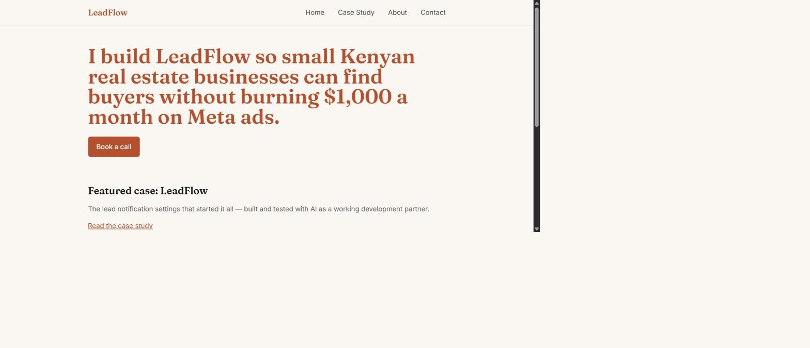
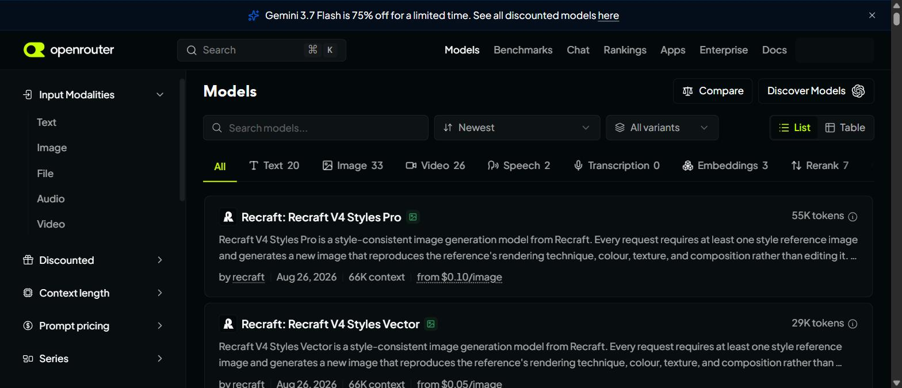
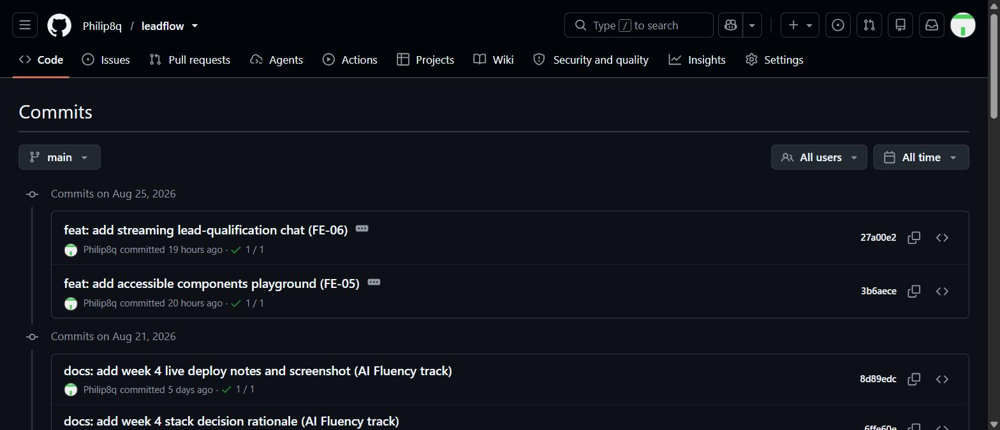

# Agent Concepts and MCP Basics — Philip Omondi

Brief: https://internship.flyrank.ai/intern/assignments/FL-05

## Workflow vs. agent, and where FL-04 fits

A **workflow** is a system where I, the developer, wire together a fixed
sequence of LLM calls and deterministic steps in advance — the control flow
(what runs, in what order, on what condition) is coded by me, and the LLM
just fills in content within each step. An **agent**, per Anthropic's
"Building Effective Agents," is a system where the LLM itself directs the
process: it decides which tool to call next, evaluates the result, and
chooses the next action in a loop, until it decides the task is done.
Workflows are predictable and cheap to reason about; agents are flexible
but harder to predict and debug, because the "program" is being written by
the model at run time.

**My FL-04 pipeline (Ship an Automation Workflow v2, the n8n Weekly
Industry Brief) is a workflow, not an agent.** Every run executes the same
fixed step graph — Gather Sources → Synthesize Trends → Format & Deliver —
in the same order, every time. Even the Groq→Gemini fallback is a
pre-wired branch: "if this node errors, follow that other path" was
decided by me at build time, not by a model reasoning about what to do
next while it runs. Nothing in the pipeline lets an LLM choose which
sources to check, skip a step, or decide it needs to gather more before
synthesizing.

## What MCP is

**MCP (Model Context Protocol)** is a standard way for an AI application
to connect to external systems, instead of every app inventing its own
bespoke integration for every tool. It exposes three kinds of things from
a server to a client: **tools** (actions the model can call, like "search
the web" or "read a file"), **resources** (data the model can read, like a
file's contents or a database row), and **prompts** (reusable prompt
templates the server offers). The common analogy is a USB-C port: one
connector shape, many devices behind it, so a client built to speak MCP
can plug into any MCP server without custom glue code per integration.

## What FL-04 would need to become an agent

Today the 4 sources are a static Google Sheet list, and the Gather Sources
step always HTML-extracts the same fixed CSS selectors — the documented
fragile point in the build (3 of 4 sources need HTML Extract, and a
`status:empty`/markup-change failure is already logged from real testing).
An agent version would hand the model real tools — web search, HTTP
fetch, sheet write — plus a goal ("produce a well-grounded weekly
real-estate trends brief"), and let it decide at runtime: which sources to
check and how many, what to do when a fixed selector fails (try a
different extraction approach instead of just logging `status:error`), and
when it has gathered enough grounded material to stop and synthesize. That
shift — from "always run these exact steps" to "the model decides the
steps based on what it finds" — is the workflow-to-agent line.

## MCP connector demo

Connected the Chrome MCP connector already available in my Claude Code
setup (any MCP client counts per the brief) and ran 3 tasks that plain
chat — no tool access — could not have done, since each needed real,
current, live data rather than anything a model could recall from
training:

**1. Read the live LeadFlow deployment's current homepage content**
(`leadflow-ten-sage.vercel.app`) — proves the site is genuinely live right
now, not just described in a README.

**2. Queried OpenRouter's live model catalog** (`openrouter.ai/models`)
and confirmed the free-tier model chosen for my FE-06 OpenRouter pivot is
real and currently listed — genuinely live data, since OpenRouter's
free-model lineup rotates and isn't fixed in any model's training data.

**3. Read the live commit history** at
`github.com/Philip8q/leadflow/commits/main` — real-time repo state, used
to double-check exactly which commits and assignment codes exist right
now rather than trusting a stale local note.

