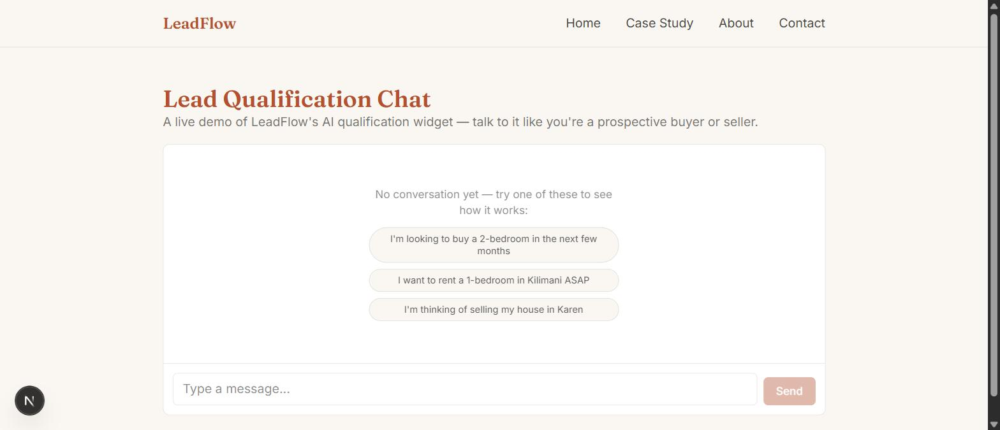
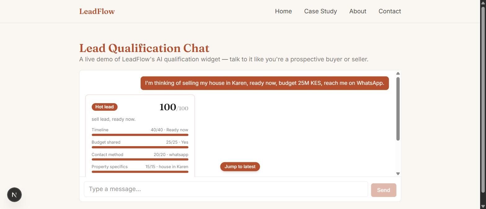
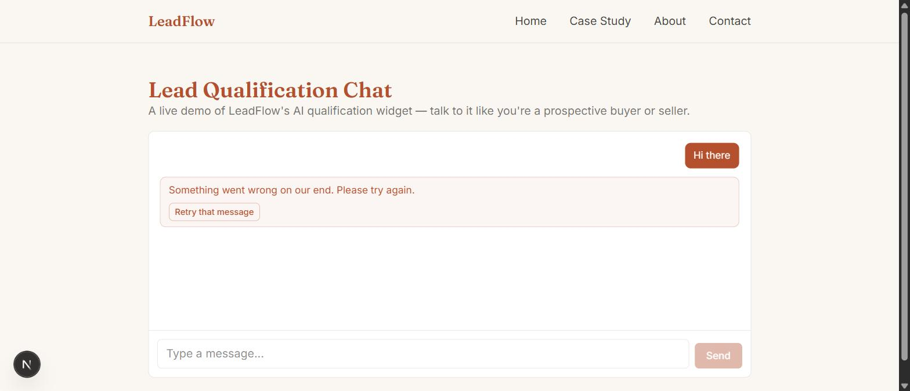
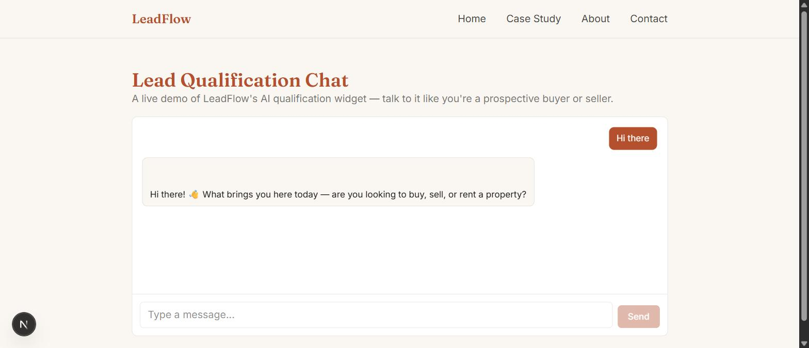
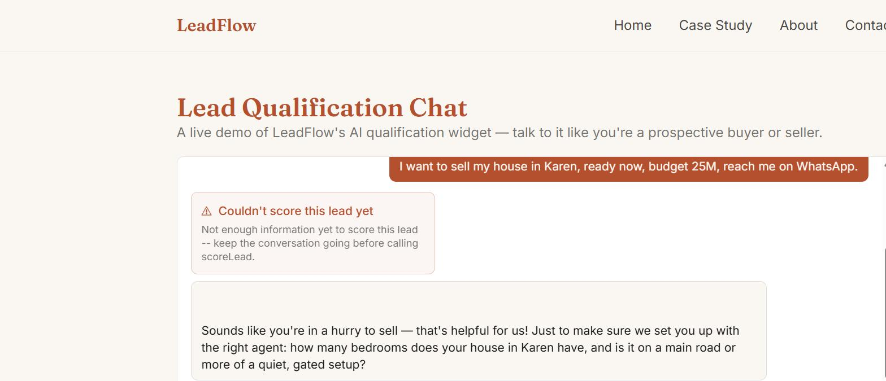

# Error States, Empty States, Edge Cases — Philip Omondi

Brief: https://internship.flyrank.ai/intern/assignments/FE-08 (Checkpoint 1)
Date: 2026-08-27

## Overview

Hardens the primary flow — the [FE-06](./STREAMING_CHAT.md)/[FE-07](./TOOL_RESULTS_UI.md)
lead-qualification chat — against the failure modes that separate a demo
from a product: network/provider failures, malformed requests, tool
errors, and a genuinely useful first-run empty state.

**Try it live:** https://leadflow-ten-sage.vercel.app/demo/lead-chat

## Failure and edge case inventory

| Case | Where it's handled | How |
| --- | --- | --- |
| Malformed request body | [`app/api/chat/route.js`](../../../app/api/chat/route.js) | Caught, returns `400` with a plain error body instead of crashing the route |
| Empty `messages` array | `app/api/chat/route.js` | Same — `400`, no unhandled exception |
| Provider error mid-stream | `app/api/chat/route.js` `describeError()` | Classified by status: `429` → "getting a lot of requests," `5xx` → "temporarily unavailable," else a safe generic message. Never forwards the raw provider error |
| Tool execution error | `lib/ai/lead-chat-tools.js` (`ToolUserError`) + `LeadScoreCard.jsx` | The tool's own safe, specific message passes through unchanged (see below) and renders as a distinct warning card, not the chat-level error banner |
| Rendering crash on the page | `app/demo/lead-chat/error.js` | Segment-scoped boundary — replaces just the chat area, app shell keeps rendering |
| Rendering crash anywhere else | `app/error.js` | Root boundary with its own "Try again" / "Go home" actions |
| Empty first-run state | `app/demo/lead-chat/page.jsx` | Three click-to-fill example prompts, not just a static caption |
| Slow / pending states | `LeadScoreCard.jsx` (`ScorePreparing`, `ScoreRunning`) + `ThinkingIndicator` | Skeletons sized to match the real content's width, avoiding layout shift when it arrives |
| Mobile Safari viewport | `page.jsx` | `100dvh`-based height (survives the keyboard resizing the viewport), `overscroll-contain` on the scroll container (stops rubber-band scroll from fighting the auto-scroll pin) |

## A real bug this design pass caught

Building the empty-input/whitespace edge case into the render filter
surfaced something visual testing had missed in FE-07: the model
sometimes emits a bare `"\n\n\n"` text part immediately before a tool
call. The original `isRenderablePart` check only tested
`part.text.length > 0`, which whitespace passes — so a blank, broken-
looking chat bubble rendered above the score card on every tool call.
Fixed by checking `part.text.trim().length > 0` instead. Caught by
actually looking at the rendered page, not by the type system or the
tests — the reminder for next time is to always eyeball a real
tool-calling conversation, not just check that the right events arrive
over the wire.

## A design mistake sabotage testing caught and fixed

`toUIMessageStream`'s `onError` is **one handler for every error in the
stream** — not just top-level provider failures, tool-execution errors
land there too. The first version of `describeError()` didn't know
that, so classifying provider errors (429 vs. 5xx vs. generic)
accidentally *replaced* `scoreLead`'s own specific, already-safe error
message ("Not enough information yet...") with the generic "Something
went wrong" fallback — a regression, not an improvement. Fixed with an
explicit `ToolUserError` class: only messages we wrote ourselves for
this exact purpose pass through verbatim; anything else (including a
provider's raw error) still gets genericized. This is exactly the kind
of interaction the brief's sabotage script is designed to surface —
found by literally forcing the tool to throw and watching what the UI
showed, not by reading the code.

## Sabotage log

Run in the order the mentor tips suggest, each one reverted immediately
after confirming the fix:

1. **Malformed JSON body** — `curl` with an invalid JSON payload → `400`
   with a clean error body, no server crash.
2. **Empty `messages` array** — same treatment, `400`.
3. **Mid-stream provider failure** — temporarily pointed the chat model at
   a nonexistent OpenRouter model ID, then sent a real message. Result: a
   designed error banner ("Something went wrong on our end. Please try
   again.") with a working **Retry that message** button — confirmed the
   retry actually recovers (re-sent just the failed turn, got a real
   response back), not just that the button renders.
4. **Tool execution failure** — temporarily forced `scoreLead`'s
   `execute()` to always throw, then held a real conversation with enough
   info to trigger a call. Result: the tool's own message ("Not enough
   information yet to score this lead...") rendered in a warning-styled
   card distinct from the chat-level error, and the assistant recovered
   gracefully by asking a follow-up question instead of getting stuck.
5. **Empty conversation on first run** — trivially confirmed: the
   click-to-fill empty state renders correctly with no messages sent yet.

All 5 runs used the real code path (the actual route handler, the actual
tool, the actual OpenRouter call) — nothing was mocked. Each sabotage was
reverted immediately after the screenshot/verification, confirmed by a
clean `git diff` before committing.

## Screenshots

| | |
| --- | --- |
| Empty state (click-to-fill) |  |
| Happy path — score card renders |  |
| Mid-stream failure — designed error + retry |  |
| After clicking Retry — recovered |  |
| Tool execution failure — distinct error card |  |

## Verification

- `npx eslint .` — clean
- `npx vitest run` — 15/15 (repo-wide suite, unaffected by this pass)
- `npm run build` — clean production build
- All 5 sabotage runs above, against the real local dev server, each
  reverted and re-verified working before moving to the next

**Not yet done:** a real mobile Safari device test (viewport keyboard
resize, rubber-band scroll) — the brief explicitly calls out that
responsive-mode testing in DevTools isn't a substitute for this. The CSS
choices (`100dvh`, `overscroll-contain`, 16px input font floor already
in place from FE-06) are the standard fixes for the specific bugs named
in the brief, but haven't been confirmed on a physical device.

## Links

- **Live preview:** https://leadflow-ten-sage.vercel.app/demo/lead-chat
- **Route handler (error classification):** https://github.com/Philip8q/leadflow/blob/main/app/api/chat/route.js
- **Tool (`ToolUserError`):** https://github.com/Philip8q/leadflow/blob/main/lib/ai/lead-chat-tools.js
- **Chat page (empty state, error banner):** https://github.com/Philip8q/leadflow/blob/main/app/demo/lead-chat/page.jsx
- **Root error boundary:** https://github.com/Philip8q/leadflow/blob/main/app/error.js
- **Chat segment error boundary:** https://github.com/Philip8q/leadflow/blob/main/app/demo/lead-chat/error.js
